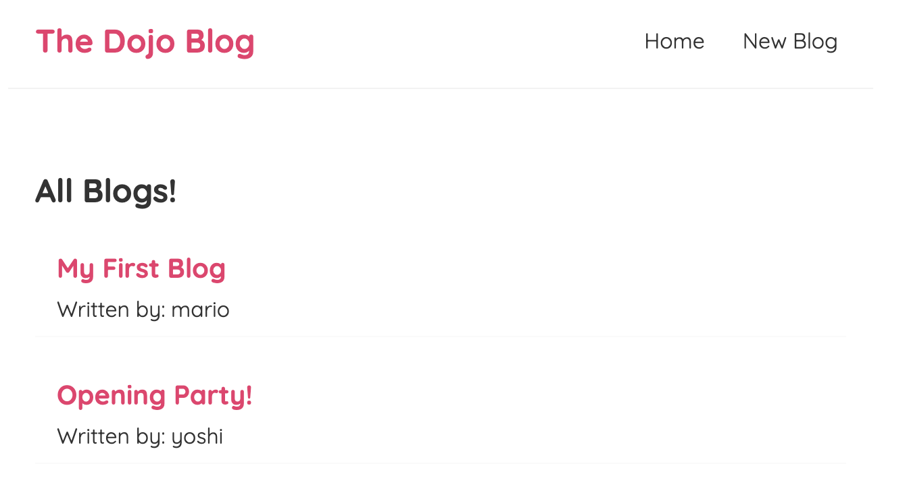
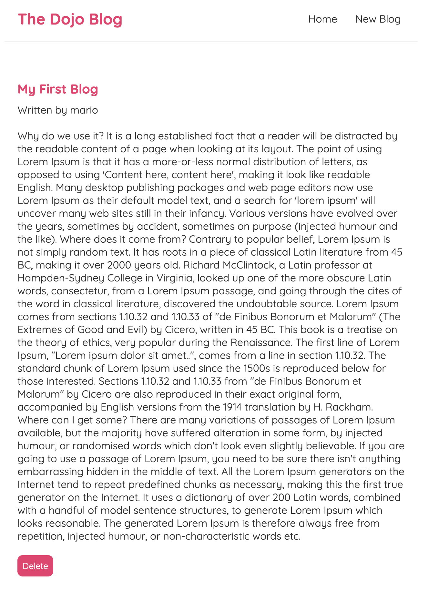
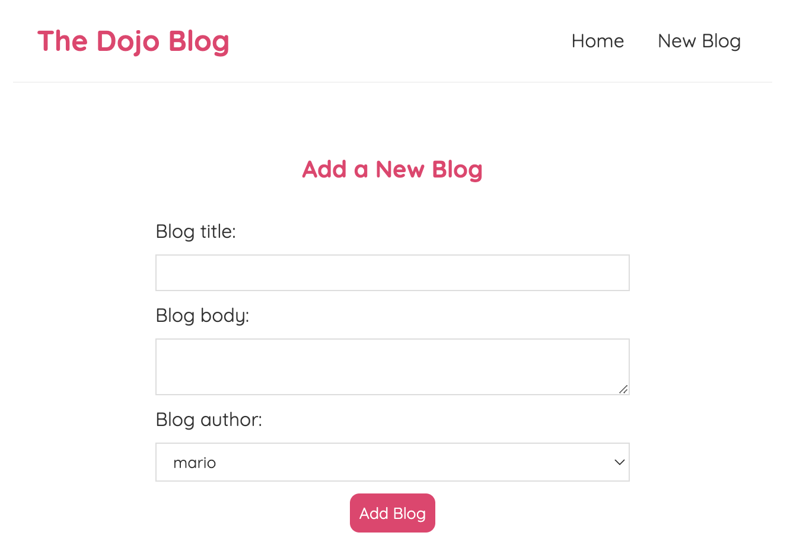
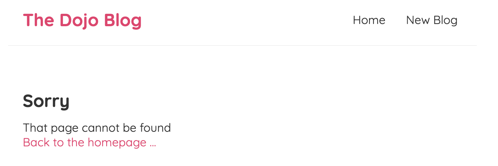

# Dojo Blog Website From React JS

## How to launch the application

To start the blog data simple json **server**
```
npx json-server --watch data/db.json --port 8000
```

To start the blog **front end UI**
```
npm start
```

## Blog Screenshots

### Home Page


### Blog Page


### Create Blog Page


### Not Found 404 Page

